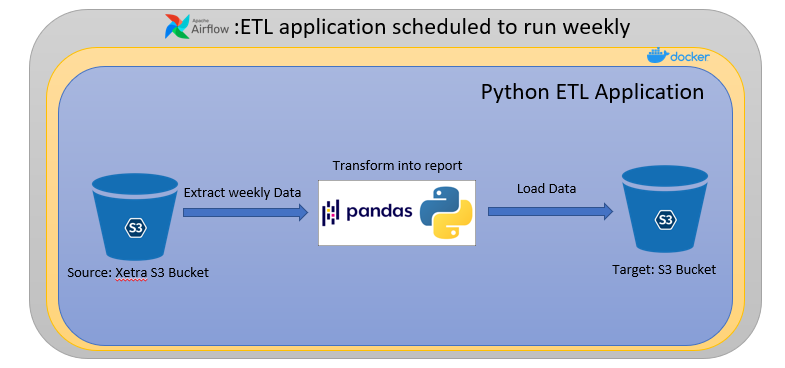
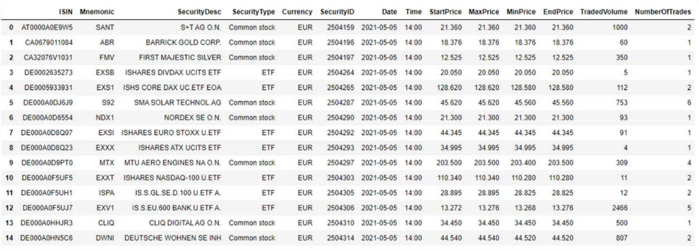
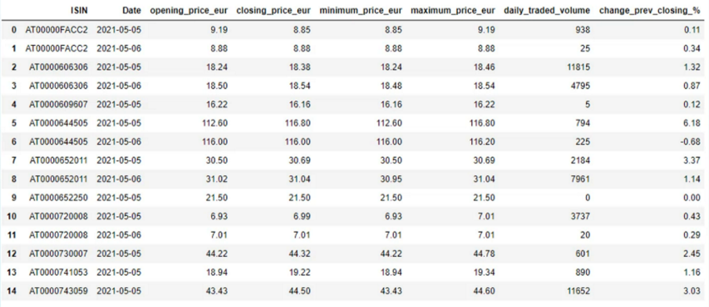
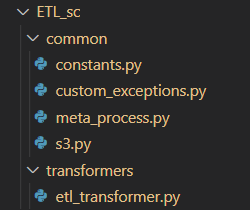
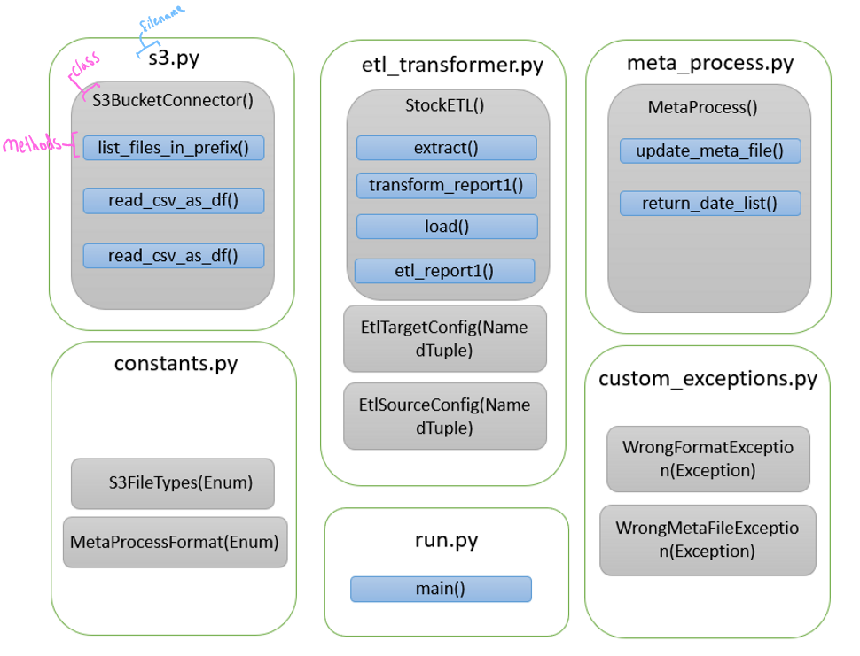
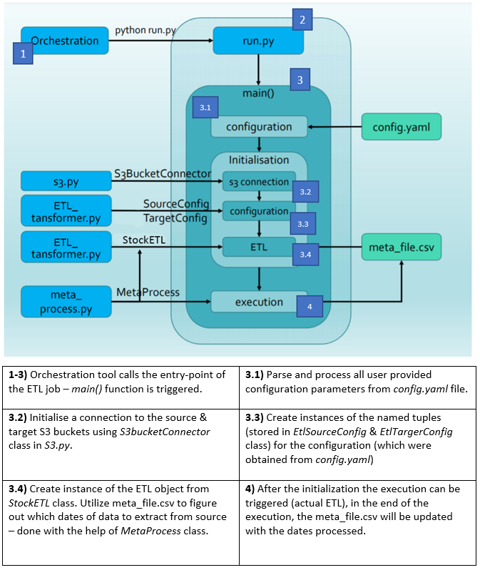

# Stock Market ETL Pipeline Python Application

***Description***

In this Data Engineering project an ETL pipeline application is created that extracts the Xetra dataset from the AWS S3 source bucket on a weekly scheduled basis, creates a report using transformations and loads the transformed data to another AWS S3 target bucket.

The production environment we are going to write the ETL pipeline for consists of a GitHub Code repository, a DockerHub Image Repository, and an Orchestration tool - Apache Airflow.

## Pipeline overview

A high-level view of the architecture:

***What is the Source Dataset Xetra and the Report produced from this data?***

Xetra stands for Exchange Electronic Trading and it is the trading platform of the Deutsche Börse Group. This dataset is derived near-time on a minute-by-minute basis from Deutsche Börse’s trading system and saved in an AWS S3 bucket available to the public for free, further details can be found [here](https://github.com/Deutsche-Boerse/dbg-pds).

Here are some rows from the **Xetra Dataset**:

Here are some rows of the Report produced from this ETL application (an aggregation is done on the ISIN):

## Python Application Overview

The source code of the application is available in the ETL_sc folder and the corresponding unit & integration tests in the tests folder of this repository, from root.

***ETL_sc folder structure:***

***The python files and their constituent in the folder ETL_sc:***

***How does the entry-point work?***

## Goals

Here are the technical goals that were achieved with this package:

- :white_check_mark: Achieved
- :white_large_square: In-progress

:white_check_mark: OOP application

:white_check_mark: virtual environment using Pipenv

:white_check_mark: exeption handling

:white_check_mark: linting using pylint

:white_check_mark: dependency management

:white_check_mark: Done unit testing (unittesting package) using mock objects (using moto & unittest.mock package)

:white_check_mark: Integration testing

:white_check_mark: Achieved 100% testing coverage - verified using coverage package.

:white_check_mark: Configuration file support to allow parameters.

:white_check_mark: Memory-profiler package used to check performance.

:white_large_square: Dockerization

:white_large_square: Orchestration using Apache Airflow

